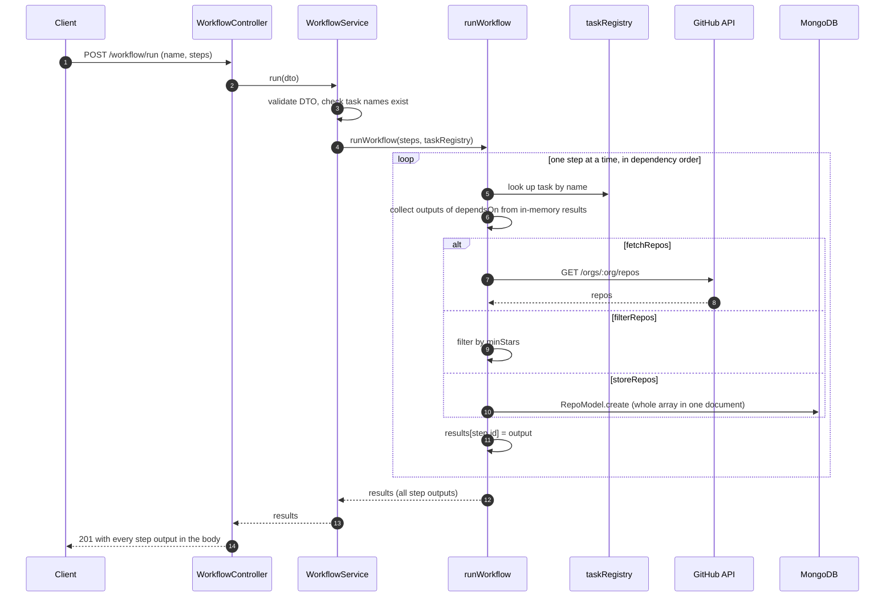
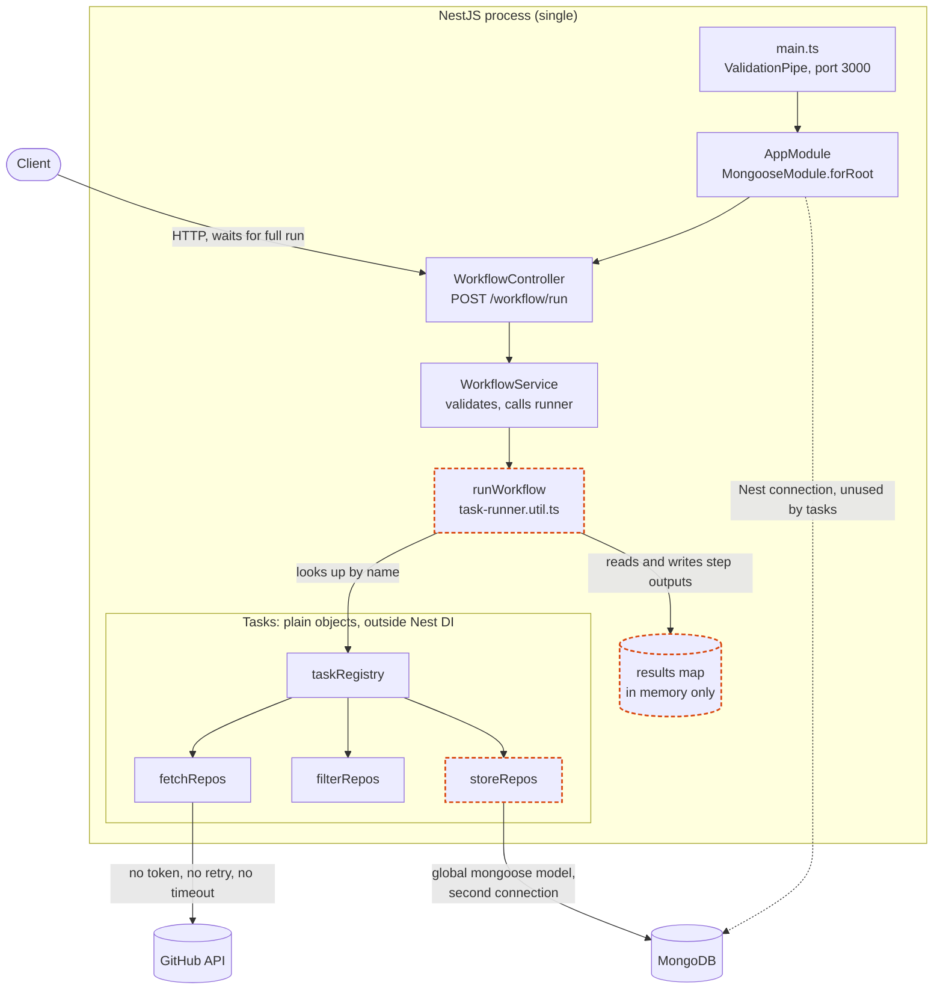
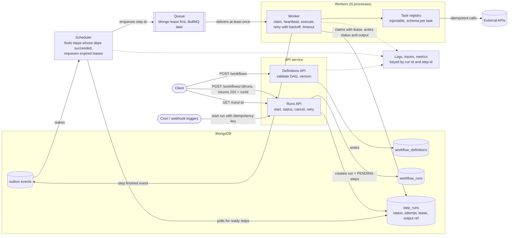
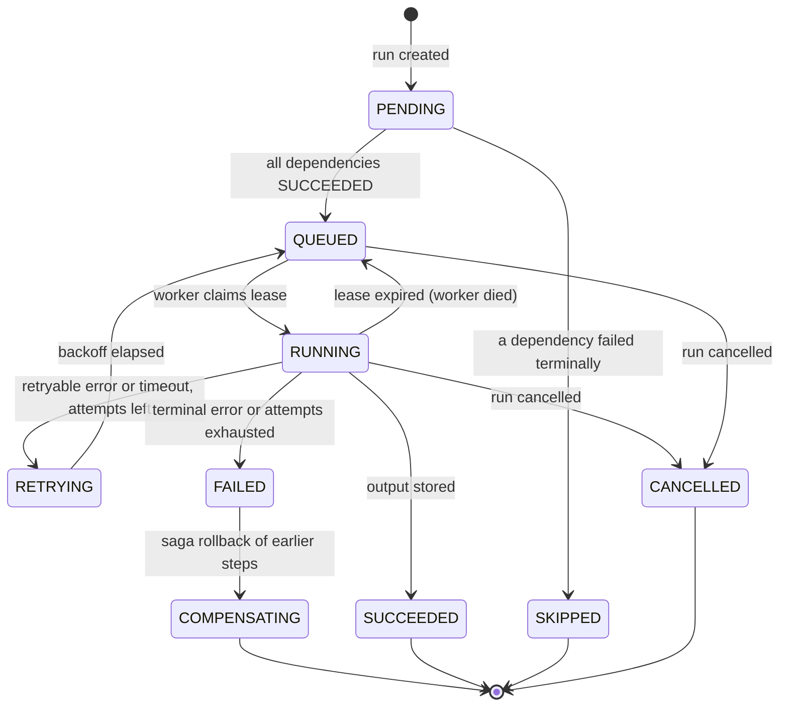

# OrchaLite architecture

Four diagrams: what the code does today (1, 2), and where the roadmap takes it (3, 4).

## 1. Today: one request runs the whole workflow

Everything happens inside the HTTP request. The run exists only in the memory of
one process, so a crash or a client timeout loses it.

## 2. Today: modules and where the weak points are

Dashed orange marks the weak points:

| Where | Problem |
| --- | --- |
| `results` map | Run state lives in memory. A crash loses the run; nothing can be inspected or resumed. |
| `runWorkflow` | Sequential only. A cycle or an unknown `dependsOn` id is skipped silently and the run still reports success. A step whose dependency returned a falsy value (for example `storeRepos`, which returns `void`) fails. |
| `storeRepos` | Uses the global `mongoose.model`, not the Nest-managed connection, so the app opens two connections. Stores the full array in one document (16MB limit). |

## 3. Target: durable engine with API, scheduler and workers split

The API only records intent. The scheduler decides what is ready. Workers do the
work and can die at any point without losing the run.

## 4. Target: lifecycle of one step

This state machine is the core of the engine. Every transition is a conditional
update on the `step_runs` document, so two workers can never both win.

## How the roadmap maps onto diagram 3

| Stage | Piece of the diagram it builds |
| --- | --- |
| 1. Persisted state machine | Runs API, `workflow_runs`, `step_runs`, diagram 4 |
| 2. API and worker split | Scheduler, Queue, Workers, leases |
| 3. Failure semantics | Retry, timeout and idempotency inside the worker |
| 4. Parallelism and backpressure | N workers, concurrency limits on the queue |
| 5. Data contracts | Definitions API, schema per task, output refs |
| 6. Sagas and triggers | Cron and webhook triggers, outbox, `COMPENSATING` |
| 7. Operability | Logs, traces, metrics |
